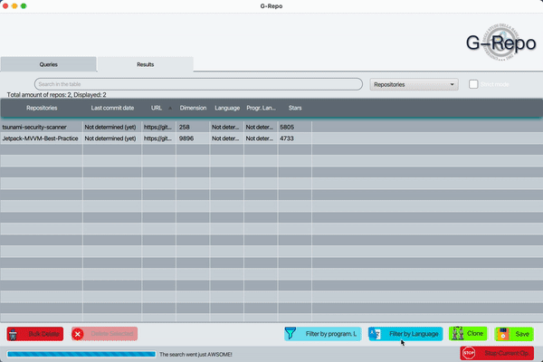

# G-Repo

G-Repo is a tool developed in java and it is useful in the **Mining Software Repository**, this area aims to collect empirical evidence using the data available in software repositories present on github.

For example:

* “When and Why Your Code Starts to Smell Bad (and Whether the Smells
Go Away)”
* “Do Developers Feel Emotions? An Exploratory Analysis of Emotions in
         Software Artifacts”

Many **MSR** studies use GitHub as a data source because:

* It contains millions of open source repositories.
* Provides a REST API to extract this data.

But which repositories to identify to conduct an **MSR** study?

* A trend is to select a number of top starred repositories, which are the most voted repositories by GitHub users.

|

|

|

|

### Language Detection
Makes possible the translation and therefore the classification of the README files present in the github repositories.

#### Requirements
* Python 3.8
* six

The script is able to classify the repositories according to the language used to write the **README.md**.

#### Usage

* By default the script uses a **nondeterministic** classification algorithm, this functionality is part of a design from the original Google project. If you want to enforce determinism, set this [line](https://github.com/MatHeartGaming/G-Repo/blob/master/risorse/GHLanguageDetection/detector.py#L56) to 0.

* If in the repository there is no README.md file or is empty, does not have enough text or contains only special characters then the repository will be classified as **unknown**, same in case some repository should throw exceptions on the parserization, otherwise will be classified in **english**, **not-english** or **mixed**.

* In addition, the script also generates a Log file which will contain information regarding the operations that have been carried out, for each session the logs will be overwritten.

#### Conclusion
For language recognition the script uses the [LangDetect](https://github.com/Mimino666/langdetect) library, a direct port of Google's language-detection library from Java to Python.

If you want to use the script individually go [here](https://github.com/anasmounsif/README-language-detector) :rocket:
