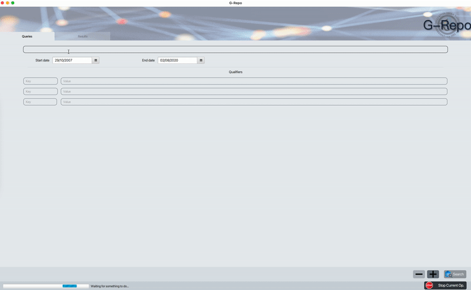
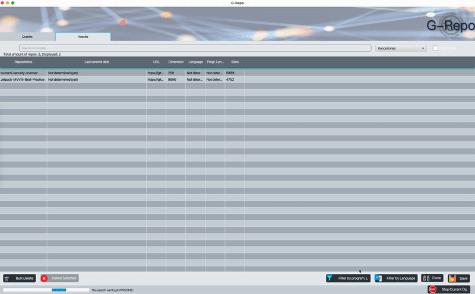
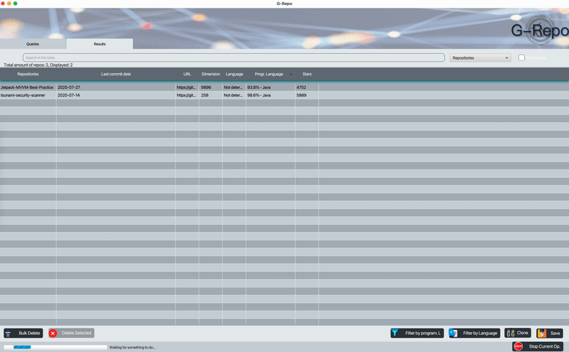

# G-Repo

[G-Repo](https://sites.google.com/view/g-repo/home-page) is a tool developed in java and it is useful in the **Mining Software Repository**, this area aims to collect empirical evidence using the data available in software repositories present on github. For example:

> *“When and Why Your Code Starts to Smell Bad (and Whether the Smells*
Go Away)”

> *“Do Developers Feel Emotions? An Exploratory Analysis of Emotions in Software Artifacts”*

Many **MSR** studies use GitHub as a data source because:

* It contains millions of open source repositories.
* Provides a REST API to extract this data.

But which repositories to identify to conduct an **MSR** study?

* A trend is to select a number of top starred repositories, which are the most voted repositories by GitHub users.
___

### Problems :no_entry:
- [x] #1:  **Limitations of the Github API**; *The GitHub Search API, which also allows you to download information about the repositories, returns a maximum of 1000 results. So if a query returns more than 1000 results, they are truncated for best-matching.*

- [x] #2: **Repository not containing the files in the required programming language**; *Very often the search returns repositories that are not actually written to the requested programming language.*

- [x] #3 **Non-English language repositories**; *Not all repositories are written in english, so as a result of a search i can get repositories with a readme written in different languages.*
___

### Requirements
* Java 14, JavaFX 14
* Python3, six
___

### Getting Started

To start [G-Repo.jar](Demos/) run the command:

`java -jar --module-path "path_to_javaFX-sdk\lib" --add-modules=javafx.controls,javafx.fxml G-Repo.jar`

G-Repo provides functionality to search for repositories by native github [qualifiers](https://docs.github.com/en/github/searching-for-information-on-github/searching-for-repositories).


======

:warning: **For the execution to be successful the repositories will be cloned!** :warning:

The **programming language detection** feature allows to detect the **programming language** - **markup** most used within the repositories, otherwise if the repository were to be empty the result will be **not classifiable**.


======

G-Repo Makes possible the translation and therefore the classification of the README files present in the github repositories.
The language detector script that G-Repo uses is able to classify the repositories according to the language used to write the **README.md**.


======

By default the script uses a **nondeterministic** classification algorithm, this functionality is part of a design from the original Google project. If you want to enforce determinism make [`OUTPUT_TYPE`](https://github.com/MatHeartGaming/G-Repo/blob/master/risorse/GHLanguageDetection/detector.py#L57)```= 0```.
If in the repository there is no README.md file or is empty, does not have enough text or contains only special characters then the repository will be classified as **unknown**, same in case some repository should throw exceptions on the parserization, otherwise will be classified in **english**, **not-english** or **mixed**.
___

## References
* The [language-map](https://github.com/blakeembrey/language-map) repository was used to generate the file used for the detection of the programming language-markup.

* For language recognition the script uses the [LangDetect](https://github.com/Mimino666/langdetect) library, a direct port of Google's language-detection library from Java to Python, moreover if you want to use the script individually take a look [here](https://github.com/anasmounsif/README-language-detector) :rocket:

