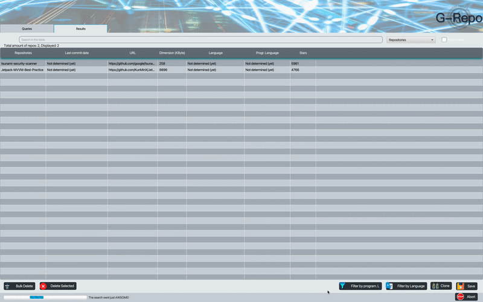

# G-Repo

[](https://youtu.be/mb9CIALBFZk)

<div align="center">
  Click above to see the tool demo on Youtube!
</div>

___

[G-Repo](https://sites.google.com/view/g-repo/home-page) is a tool developed in Java and Python and it is useful to **Mine Software Repository** (i.e., to collect empirical evidence using the data available in software repositories). For example:

> *“When and Why Your Code Starts to Smell Bad (and Whether the Smells*
Go Away)”

> *“Do Developers Feel Emotions? An Exploratory Analysis of Emotions in Software Artifacts”*

Many **MSR** studies use GitHub as a data source because:

* It contains millions of open source repositories.
* Provides a REST API to extract this data.

But which repositories must be chosen to conduct an **MSR** study?

* A trend is to select a number of top starred repositories, which are the most voted repositories by GitHub users.

### Problems :no_entry:
- [x] #1:  **Limitations of the Github API**; *The GitHub Search API, which also allows you to download information about the repositories, returns a maximum of 1000 results. So if a query returns more than 1000 results, they are truncated for best-matching.*

- [x] #2: **Repository not containing the files in the required programming language**; *The search often returns repositories that are not actually written in the requested programming language.*

- [x] #3: **Non-English language repositories**; *Not all repositories are written in English, so as a result of a search it is very likely that the user gets repositories with a readme written in different language(s).*
___

### Launch Requirements
* [Java 14](https://www.oracle.com/java/technologies/javase-downloads.html)
* [JavaFX 14](https://gluonhq.com/products/javafx/)
* [Python3](https://www.python.org)
```
$ pip3 install six
$ pip3 install langdetect
```

### Getting Started

To launch [G-Repo.jar](G-Repo-jar/) move in G-Repo-jar folder and run the command:

`java -jar --module-path "absolut/path/to/javaFX-sdk/lib" --add-modules=javafx.controls,javafx.fxml G-Repo.jar`

G-Repo provides functionality to search for repositories by native GitHub qualifiers listed below: 


| Type of Search | Qualifier to specify |
|----------------|----------------------|
|By Repos Name|repo:owner/name |
|Within User’s or Organization’s Repos|user:USERNAME, org:ORGNAME|
|By Size in KB|size:n, size:(>;<=;>=;<)n, size:n1..n2|
|By Number of Followers|followers:n, followers:(>;<=;>=;<)n, followers:n1..n2|
|If Forked or not | fork:true(false)|
|By Number of Stars|stars:n, stars:(>;<=;>=;<)n, stars:n1..n2|
|By Language|language:LANGUAGE|
|By Topic|topic:TOPIC|
|By Number of Topics|topics:n, topics:(>;<=;>=;<)n, topics:n1..n2|
|By License|license:[LICENSE](https://docs.github.com/en/free-pro-team@latest/github/creating-cloning-and-archiving-repositories/licensing-a-repository#searching-github-by-license-type)|
|If Public or Private| is:public(private)|
|If a Mirror or ot| mirror:true(false)|
|If Archived or not| archived:true(false)|
|By Number of Issues good-first| good-first-issues:>n|
|By Number of Issues help-wanted| help-wanted-issues:>n|

In order for the search to be successful, you must have a valid token!


======

:warning: **For the execution to be successful the repositories will be cloned!** :warning:

The **programming language detection** feature allows to detect the **programming language** - **markup** most used within the repositories; if the repositories found are empty the result will be **not classifiable**.


======

G-Repo is also able to detect the language used for a given repository by analyzing its **README.md** file.
The language detector script that G-Repo uses is capable of classifying the repositories according to the language used within the **README.md**.


======

By default the script used by G-Repo uses a **nondeterministic** classification algorithm. This functionality is part of a design from the original Google project. If you want to force it to use a deterministic approach put [`translation_type = 0`](https://github.com/MatHeartGaming/G-Repo/blob/master/G-Repo-jar/G-Repo-Resources/LanguageDetection/config.ini#L8).
If the repository lacks a README file, it is empty, does not have enough text, or it only contains special characters then the repository will be classified as **unknown**, and the same applies in case some repository throws an exception during the parserization process, otherwise if everything goes fine it will be classified as **english**, **not-english** or **mixed**.


## References
* The [language-map](https://github.com/blakeembrey/language-map) repository was used to generate the file used for the detection of the programming language-markup.
* For the language recognition see [Language Detection](https://github.com/anasmounsif/Language_Detection) :rocket:
